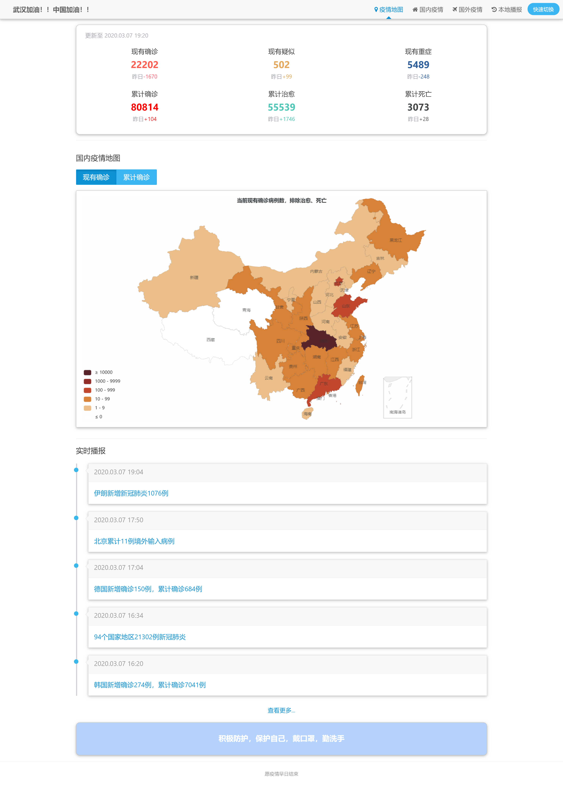
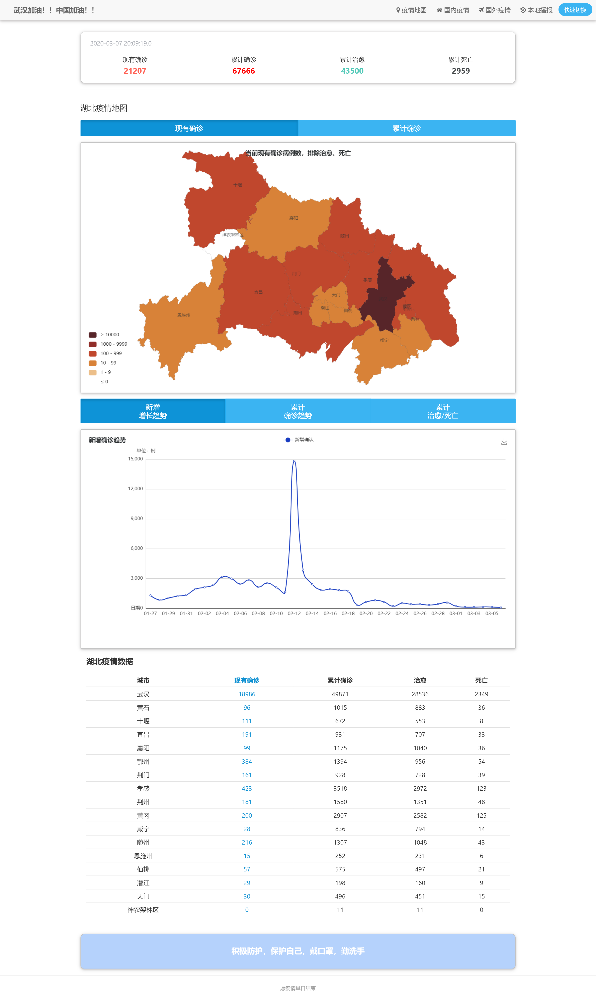

# epidemic_nCov2019
一个基于爬虫的疫情数据数据展示网站。由于疫情，宅在家里心血来潮。希望武汉的疫情早日结束！！
爬虫数据来源:"https://3g.dxy.cn/newh5/view/pneumonia"
#### 网站功能介绍：
* 国内疫情的数据展示
* 国外疫情的数据展示
* 实时快讯的展示
* 一点点的疫情数据可视化（基于ECharts的图表）
#### 项目所采用的技术栈：
* SpringBoot + Thymeleaf +MyBatis
* ECharts 基于js的图表绘制
* Quartz 后台定时任务
* Jsoup爬虫
* 前端：AmazeUI（妹子UI）  
#### 项目截图

#### 部署方式
1. 管理工具：Gradle
2. 数据库：MySql 8.0
3. 执行init.sql建表(src/main/resources/sql/init.sql)
4. 启动项目，log输出爬虫启动成功则成功启动

#### 缓存机制
SpringBoot默认缓存：ConcurrentMap
由于爬虫每小时进行数据库数据刷新，缓存有效时长（1h）
数据刷新前，所有缓存清空
存在可改进地方：判断是否需要更新数据库，在清空缓存

